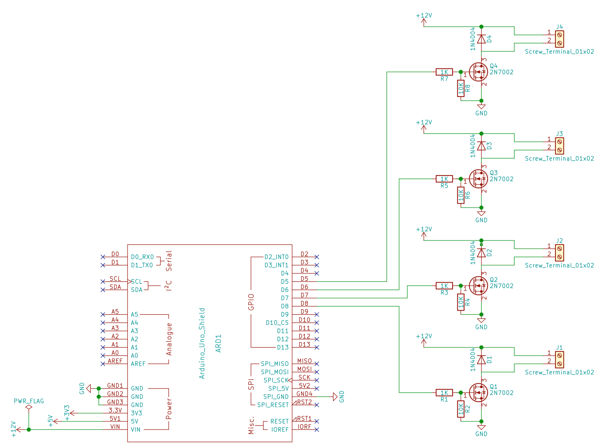
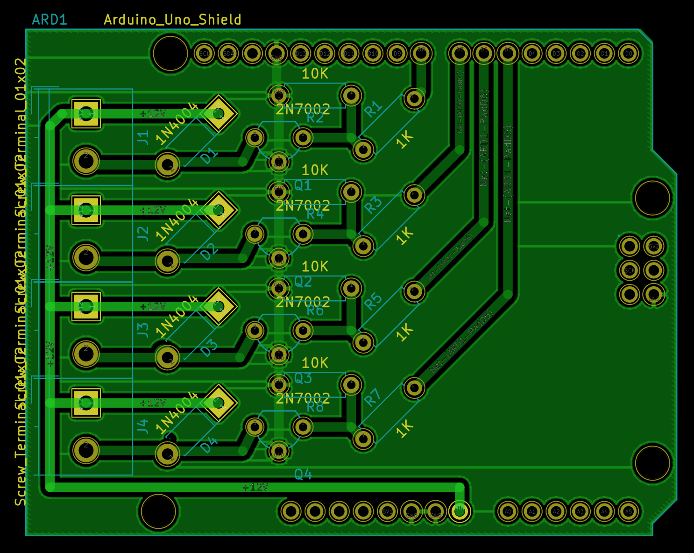

Relay Driver Shield
===================

An Arduino shield for designed for controlling four 12v relays.
The schematic and PCB layout were created using [KiCad](http://kicad-pcb.org/).

While it is designed for relays, it can be used for powering anything
that requires a bit more current or voltage.

| Arduino Pin | Function  |
|-------------|-----------|
| `D5`        | Relay 1   |
| `D6`        | Relay 2   |
| `D7`        | Relay 3   |
| `D8`        | Relay 4   |

The output voltage is determined by the input voltage on the Arduino Board - the `VIN` pin.

Schematic
---------

PCB Layout
----------

Dependencies
------------

This shield makes use of the [Arduino KiCad Library](https://github.com/Alarm-Siren/arduino-kicad-library)
by [Nicholas Parks Young](https://github.com/alarm-siren).

License
-------

All of the files in this repository are licensed under
[Creative Commons Attribution Share-Alike License 4.0 CC-BY-SA](https://creativecommons.org/licenses/by-sa/4.0/).
